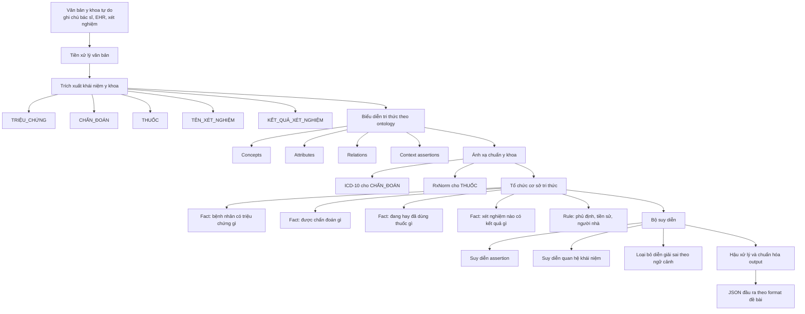
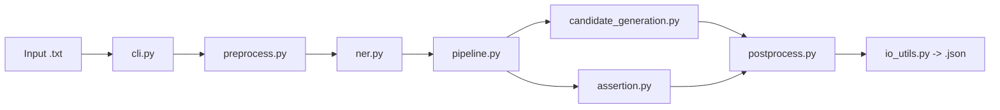

# Luồng Hybrid Ontology + AI Y Khoa

Tài liệu này chuyển pipeline hiện tại sang cách nhìn của bài báo về `ontology + knowledge base + inference engine`, nhưng vẫn giữ các bước NLP/AI cần thiết cho bài toán.

## 1. Luồng tổng thể

## 2. Ánh xạ từ bài báo sang hệ thống này

| Theo bài báo | Trong hệ thống hiện tại |
| --- | --- |
| Ontology | Schema y khoa cho thực thể, thuộc tính, quan hệ, assertion |
| Knowledge base | Fact trích từ văn bản + ICD-10 + RxNorm + từ điển alias |
| Inference engine | Assertion detection + relation reasoning + hậu kiểm ngữ cảnh |
| Mô hình hóa bài toán | Chuyển đoạn văn bản thành ca lâm sàng có cấu trúc |
| Ứng dụng | Xuất JSON chuẩn hóa phục vụ liên thông dữ liệu và AI downstream |

## 3. Luồng kỹ thuật sát với code baseline

## 4. Khung ontology đề xuất

- `PatientCase`
- `Symptom`
- `Diagnosis`
- `Drug`
- `LabTest`
- `LabResult`
- `AssertionContext`

Các quan hệ nên có:

- `has_symptom(PatientCase, Symptom)`
- `has_diagnosis(PatientCase, Diagnosis)`
- `uses_drug(PatientCase, Drug)`
- `has_lab_test(PatientCase, LabTest)`
- `has_lab_result(LabTest, LabResult)`
- `has_assertion(Entity, AssertionContext)`
- `mapped_to_icd10(Diagnosis, Code)`
- `mapped_to_rxnorm(Drug, Code)`

## 5. Bản ngắn để đưa vào slide

## 6. Câu mô tả ngắn có thể dùng trong báo cáo

Hệ thống được thiết kế theo hướng lai giữa AI xử lý ngôn ngữ và hệ cơ sở tri thức dựa trên ontology. Văn bản y khoa tự do trước hết được tiền xử lý và trích xuất các khái niệm lâm sàng, sau đó các khái niệm này được biểu diễn dưới dạng ontology, ánh xạ với các chuẩn ICD-10 và RxNorm, nạp vào cơ sở tri thức, rồi đưa qua bộ suy diễn để xác định ngữ cảnh và quan hệ trước khi sinh đầu ra JSON chuẩn hóa.
